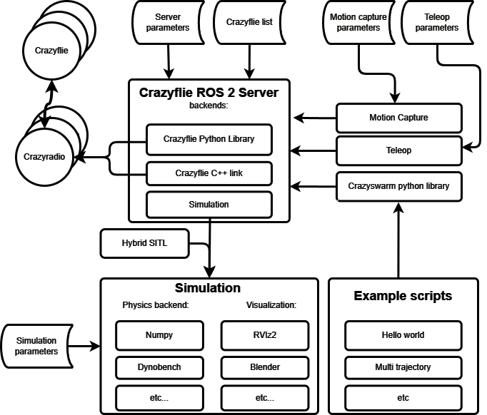

<!-- Compile using:

docker run --rm --volume $PWD:/data --user $(id -u):$(id -g) --env JOURNAL=joss openjournals/inara
-->

<!-- Relevant JOSS example papers:

- https://joss.theoj.org/papers/10.21105/joss.07481
- https://joss.theoj.org/papers/10.21105/joss.07473
- https://joss.theoj.org/papers/10.21105/joss.06771
- https://joss.theoj.org/papers/10.21105/joss.05647
-->

# Summary

Validation of multi-robot and robot swarm research in the physical world requires a *testbed*, i.e., easily accessible robots and a software stack that is well tested and simplifies the operation of common use cases.
We present Crazyswarm2, a software stack that uses the Robot Operating System 2 (ROS 2) [@ros2] at its core and enables simulation, visualization, and control of commercially off-the-shelf flying robots from Bitcraze AB.
These robots are popular amongst researchers because they are fully open (including schematics and low-level firmware), extendible using standardized connectors, and can be easily obtained world-wide.
Our software made significant changes to Crazyswarm [@crazyswarm], a popular ROS 1-based stack that has been widely used in the research community for planning, state estimation, controls, and even art.
While the high-level API is identical, we used the required breaking changes when moving to ROS 2 to re-visit some core design decisions and enable more sophisticated use-cases compared to the original Crazyswarm.

# Statement of Need

Testbeds are crucial for research in robotics as the simplify and accelerate data collection and validation experiments.
The de-facto standard for physical robots is the Robot Operating System 2 (ROS 2) [@ros2], because robot vendors typically provide drivers and examples using this middleware. 
Most research labs for flying robots either use large custom-built multirotors with a powerful companion computer (e.g., @mrs-uav-system) or the Crazyflie robots by Bitcraze AB.
However, the official vendor software does not have any ROS 2 support and does not scale well to control larger teams of robots.
There are two parallel efforts to mitigate the first issue: CrazyChoir [@crazychoir] and AeroStack2 [@aerostack2]. Both rely on the official Python API, making it difficult to use larger teams, while our default backend is written in C++ and significantly faster. The focus of CrazyChoir is on distributed optimization and for AeroStack2 on high-level missions. In contrast, Crazyswarm2 provides just the essential tools for simulation, visualization and control to allow a wide variety of applications, including applications that require significant low-level firmware changes. Differences between the systems and tutorials were provided at the "Aerial Swarm Tools and Applications" workshop at the Robotics Science and Systems conference [@aerialswarms-workshop].

AI W: add statement about dynamicsSwarm

<!-- # Design and Implementation Choices -->
# Architecture

<!-- optional, but might be interesting and is something that the RobotDART paper has -->

AI: K
  - architecture diagram + text

AI: W
  - changes compared to CS1, broadly speaking explain reasoning
  - latency measurement cpp/cflib backend over number of CFs (see example from kimberly)

{#architecture-diagram width="100%"}

The architecture of Crazyswarm2 can be found in \autoref{architecture-diagram}. The Crazyflie server is the node that connects the Crazyflies to the ROS 2 framework. Its main components contain the Crazyflie Server, the simulation framework, and a separate Python library that simplifies the command handling through ROS 2.

The Crazyflie server receives a list of Crazyflie URIs and ROS server parameters, and it will connect to multiple Crazyflies through multiple Crazyradio PAs. Moreover, this configuration YAML file will also contain all the logging and parameters that need to be initialized within the Crazyflie ecosystem. It will then convert those specific logging and parameters to their ROS 2 equivalent and prepare them in proper topics and parameter types.

Moreover, the server also converts any control topics to their Crazyflie framework equivalent through the commander structure, which is used for both the pitch/roll/yaw and velocity/position commands for control in real time. Moreover, the Crazyflie's high-level commander [REF] framework is accessed through ROS 2 services, which only need to be called upon once and the Crazyflie will execute the command fully onboard. Moreover, services also exist to enable logging/parameters upon runtime, as well as an emergency service that will shut down the Crazyflie for safety.

The Crazyflie server relies on 3 different backends: (1) the Crazyflie C++ library, (2) the Crazyflie Python library, and (3) the simulation backend. (1) was a C++-based library that was developed in light of the Crazyswarm (1) project and reimplemented for Crazyswarm2. In time, (2) the Crazyflie Python library was added and made almost feature complete with (1). Cflib (Crazyflie Python Library) is the officially maintained communication library by Bitcraze AB, the developers of the Crazyflie.

The simulation backend acts as a gateway to the hybrid software-in-the-loop (SITL) simulation. The hybrid SITL consists of wrappers of the original Crazyflie's C-based firmware into Python functions, which can be called from the ROS 2 node. The simulation backend also has various physics and visualization sub-backends to choose from. The physics backends consist of various options, like a simple quadcopter dynamics based on the Python library NumPy and a dynamics library called Dynobench [REF]. The visualization backends consist of libraries like the ROS 2 native RViz2, or Blender for high-level rendering purposes for camera sensing.

Finally, the Crazyswarm2 architecture also consists of a separate ROS 2 package that is a Python library. The main purpose of this library is to create a simpler interface for the users to control their Crazyflies as a layer above the full ROS 2 interface. Instead of writing service calls and topic publishers, they can call simple functions per Crazyflie entity in this library, which handles the ROS 2 calling on the backend.

Additionally, the Crazyswarm2 architecture supports integration with motion capture systems which feed positioning data into the Crazyflie server. To help users get started with the framework, Crazyswarm2 also includes a collection of example scripts that demonstrate common use cases, ranging from simple "Hello World" demonstrations to more complex multi-trajectory coordination scenarios.

# Scientific Impact

<!-- optional, perhaps better suited to integrate into the statement of need? Essentially, we want to already list "users" here -->

WH

# Conclusion and Future Work

# Conflict of Interest

Kimberly N. McGuire started her work on Crazyswarm2 while being employed at Bitcraze AB, Sweden, the vendor of the robots supported in this stack. She is currently an independent roboticist with no financial relationship to Bitcraze AB.

# Acknowledgements

The work was supported by Deutsche Forschungsgemeinschaft (DFG, German Research Foundation) under Grant 448549715 and the Federal Ministry for Research, Technology and Aeronautics Germany (BMFTR) under Grant 16ME1000.

We would also like to thank one of the original author of the predecessor project, Crazyswarm, namely James A. Preiss as well as the contributors of Crazyswarm2.

# TODO

- mention crazysim (?) [@crazysim]
- mention our prior survey paper on simulation tools [@aerial-sim-survey]
- create a curated list of users / relevant papers that use Crazyswarm2
- latency measurements or other interesting results for the Design / Implementation Choices?
- add a cool figure
- repo clean-up (docs folder; ros_ws folder)
- add dynamicSwarms

# References